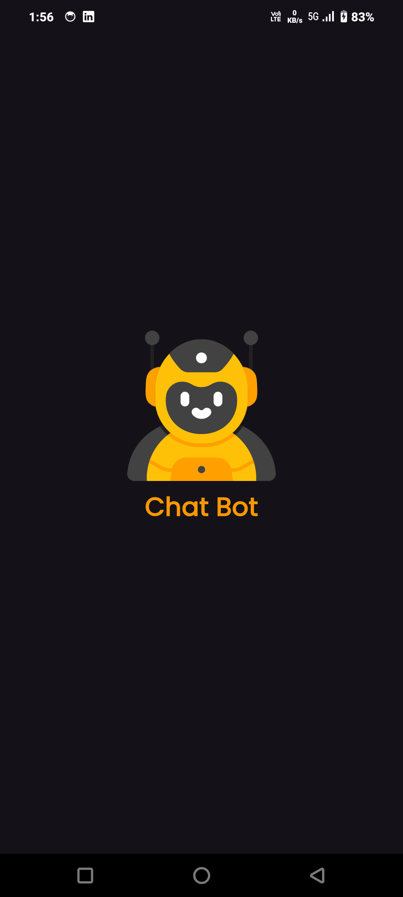

# Chat Bot App


A modern, interactive Chat Bot application built with Flutter, featuring animated responses and AI-powered conversations. This application provides a seamless real-time messaging experience with a clean and intuitive user interface.

## ✨ Features

-   **📩 Real-time AI Chat**: Engage in dynamic conversations with AI-generated responses powered by Google Gemini API.
-   **✍️ Animated Typing Effect**: Enjoy a lively chat experience with animated typing effects for bot messages using `AnimatedTextKit`.
-   **📄 Local Message History**: Your chat history is securely stored locally for easy access and continuity.
-   **🌙 Dark & Light Mode**: Seamlessly switch between beautiful dark and light themes to suit your preference.
-   **📌 User-friendly UI**: A clean, modern, and responsive design ensures a smooth and enjoyable user experience with fluid animations.

## 📸 Screenshots

<div align="center">
  
  
  
</div>

## 🚀 Getting Started

Follow these instructions to get a copy of the project up and running on your local machine for development and testing purposes.

### Prerequisites

-   [Flutter SDK](https://flutter.dev/docs/get-started/install)
-   [Android Studio](https://developer.android.com/studio) / [VS Code](https://code.visualstudio.com/) with Flutter and Dart plugins
-   A physical device or emulator for running the app

### Installation

1.  **Clone the repository:**

    ```bash
    git clone https://github.com/yourusername/chat-bot-app.git
    cd chat-bot-app
    ```

2.  **Install dependencies:**

    ```bash
    flutter pub get
    ```

### API Integration (Google Gemini API)

This application uses the Google Gemini API for AI-powered responses. You need to obtain your own API key and integrate it into the project.

1.  **Get your API key:**
    -   Visit the [Google Cloud Console](https://console.cloud.google.com/)
    -   Create a new project or select an existing one.
    -   Enable the Gemini API (or Generative Language API).
    -   Go to `APIs & Services` > `Credentials` and create an API key.

2.  **Add your API key to the project:**
    -   Open the file `lib/data/remote/api_helper.dart`.
    -   Replace `"YOUR_API_KEY"` with your actual API key:

    ```dart:lib%2Fdata%2Fremote%2Fapi_helper.dart
    const String apiKey = "YOUR_API_KEY"; // Replace with your actual API key
    ```

### Running the App

1.  **Connect a device:**
    -   Ensure you have a physical Android/iOS device connected with USB debugging enabled, or an emulator running.
    -   Verify your device is recognized by Flutter:

    ```bash
    flutter devices
    ```

2.  **Run the application:**

    ```bash
    flutter run
    ```

    The app will launch on your connected device or emulator.

## 📦 Dependencies

-   `flutter`: The UI toolkit for building natively compiled applications for mobile, web, and desktop from a single codebase.
-   `provider`: A simple yet powerful state management solution for Flutter.
-   `animated_text_kit`: A Flutter package that provides a collection of cool and beautiful text animations.
-   `intl`: Provides internationalization and localization facilities, including message formatting, date and number formatting and parsing, and bidirectionality. (Used for date/time formatting in messages).

## 🤝 Contributing

Contributions are welcome! If you have suggestions for improvements or new features, please follow these steps:

1.  Fork the repository.
2.  Create a new branch (`git checkout -b feature/YourFeature`).
3.  Make your changes.
4.  Commit your changes (`git commit -m 'Add some feature'`).
5.  Push to the branch (`git push origin feature/YourFeature`).
6.  Open a Pull Request.

For major changes, please open an issue first to discuss what you would like to change.

## 📄 License

This project is licensed under the MIT License - see the <mcfile name="LICENSE" path="LICENSE"></mcfile> file for details.

---